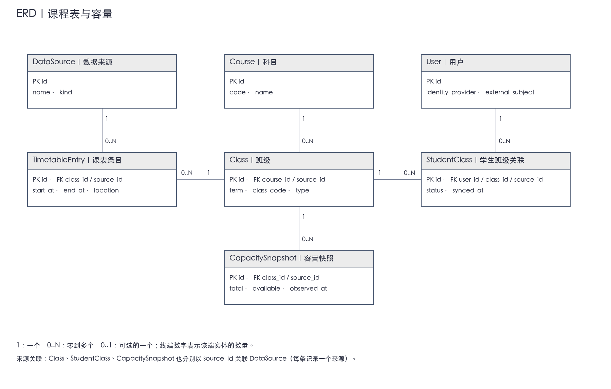
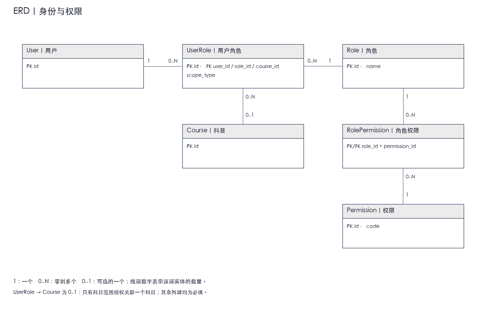
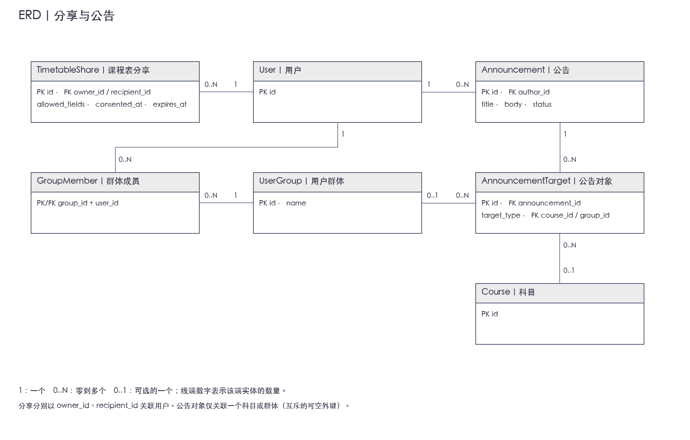
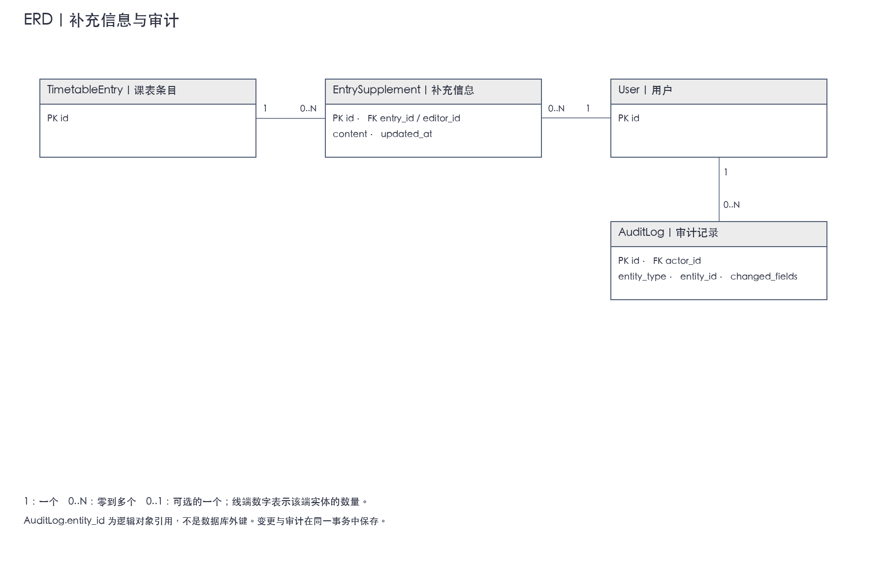

# 数据模型与 ERD

本稿保留试点系统的逻辑模型。2026-09-19 已落实第二步的 PostgreSQL/Drizzle 物理结构；实现细节、约束及测试见[数据库说明](../app/docs/database.md)，SQL 迁移见 [app/drizzle](../app/drizzle)。后续分享、公告及审计仍为规划。

## 1. 建模原则

- **科目、班级、课程表条目分开：**一门科目可以有多个班级，一个班级可以有多次具体上课安排。
- **官方安排与本地补充分开：**从批准数据源同步课程安排；教职员工只维护批准的补充字段，不直接覆盖官方记录。
- **容量独立记录：**容量和课程表可能来自不同来源、在不同时间更新，不能共用一个验证状态。
- **选课关系只读同步：**本系统记录学生所属班级用于查询，不提供修改选课或分班能力。

所有实体使用独立 ID。下表列出关键字段；PK 表示主键，FK 表示外键。ERD 分四张展示，共用的实体代表同一张表。

## 2. 课程表与容量

| 实体 | 关键字段 | 用途 |
| --- | --- | --- |
| User（用户） | id PK、identity_provider、external_subject、display_name | 关联认证身份；不在业务模型中自行保存密码 |
| Course（科目） | id PK、code、name | 保存科目定义 |
| Class（班级） | id PK、course_id FK、source_id FK、external_id、term、class_code、type | 某学期的具体教学班，如某个 Tutorial 班 |
| TimetableEntry（课程表条目） | id PK、class_id FK、source_id FK、external_id、start_at、end_at、location、verification_status、source_updated_at、synced_at | 一次具体上课安排；重复课程展开为多条记录 |
| StudentClass（学生班级关联） | id PK、user_id FK、class_id FK、source_id FK、external_id、status、synced_at | 从批准来源同步学生与班级的关系 |
| CapacitySnapshot（容量快照） | id PK、class_id FK、source_id FK、total、available、observed_at、verification_status | 保存某班级在某时刻的容量或可用名额 |
| DataSource（数据来源） | id PK、name、kind、last_success_at | 标识正式、测试或补充来源；不存储连接密钥 |

**关系：**科目 1 → 多班级；班级 1 → 多课程表条目及容量快照；用户与班级通过 StudentClass 建立多对多关系。每条同步记录关联一个来源。

**约束：**

- external_subject 与 identity_provider 的组合唯一；外部记录标识在所属来源内唯一，支持重复同步而不重复创建。
- 同一用户与班级只有一条 StudentClass 当前关联，通过 status 表示有效或失效。
- 课程结束时间晚于开始时间；保存实际时刻，并明确校园展示时区。
- total、available 可以为空；空值表示未知，零表示已知为零。暂不假定 available 等于容量减去本系统学生数。
- 同一班级可有多个来源的容量快照；优先来源、有效期及验证规则由客户确认，不能仅取任意最新记录。
- 测试来源不能标记为经过验证的正式数据；synced_at 表示本系统接入时间，不代表源数据产生时间。

## 3. 身份、角色与权限

| 实体 | 关键字段 | 用途 |
| --- | --- | --- |
| Role（角色） | id PK、name | 学生、教职员工等角色定义，具体角色由大学确认 |
| Permission（权限） | id PK、code | 如查看课程记录、维护补充信息、发布公告 |
| RolePermission（角色权限） | role_id PK/FK、permission_id PK/FK | 定义一个角色包含哪些操作权限 |
| UserRole（用户角色） | id PK、user_id FK、role_id FK、scope_type、course_id FK（可空） | 将角色授予用户，并限定为全局或某个科目范围 |

**关系：**用户与角色通过 UserRole 建立多对多关系；角色与权限通过 RolePermission 建立多对多关系。科目范围的角色授权关联 Course。

**约束：**

- Permission.code 唯一，角色权限组合不得重复。
- scope_type 为 course 时必须指定 course_id；为 global 时 course_id 必须为空；同一授权不得重复。
- 全局授权必须明确授予，不能将“没有科目 ID”直接解释为所有课程均可访问。
- 角色权限与记录范围同时检查；学生课表访问还需核对 StudentClass 或有效分享授权。
- 第二步已按 Better Auth 核心 User 字段建立唯一 `user` 表；所有业务引用同一 `user.id`。上游人员标识通过 `identity_link` 映射，组合唯一；认证 account/session/verification 表和凭据由第三步补充，不把人员映射当作登录验证。

## 4. 分享、公告与补充信息

| 实体 | 关键字段 | 用途 |
| --- | --- | --- |
| TimetableShare（课程表分享） | id PK、owner_id FK、recipient_id FK、start_at、end_at、allowed_fields、consented_at、expires_at、revoked_at | 建议采用指定接收人的授权记录，限制时间范围与可见字段 |
| UserGroup（用户群体） | id PK、name | 公告可面向的用户群体 |
| GroupMember（群体成员） | group_id PK/FK、user_id PK/FK | 保存用户与群体的多对多关系 |
| Announcement（公告） | id PK、author_id FK、title、body、status、published_at、withdrawn_at、revision | 支持草稿、发布和撤回状态 |
| AnnouncementTarget（公告对象） | id PK、announcement_id FK、target_type、course_id FK（可空）、group_id FK（可空） | 一条记录表示一个目标科目或群体；多个对象取并集 |
| EntrySupplement（课表补充信息） | id PK、entry_id FK、editor_id FK、content、updated_at、revision | 与官方条目关联的本地补充内容，具体允许维护的字段待确认 |
| AuditLog（审计记录） | id PK、actor_id FK、action、entity_type、entity_id、changed_fields、created_at | 记录教职员工操作对象和变更；只保留必要审计内容 |

**关系：**一位用户可创建或接收多条分享；公告有一名作者和多个目标；用户可加入多个群体；课程表条目可有多条补充记录；教职员工操作关联审计记录。

**约束：**

- 读取分享内容时重新检查同意、接收人、期限、撤销状态及字段范围，不能只凭知道分享 ID 就放行。分享形式和撤销策略仍需客户确认。
- AnnouncementTarget 的 course_id、group_id 必须与 target_type 一致且仅填写一个；不得重复添加同一目标。
- 学生的科目归属由有效 StudentClass → Class → Course 确定；群体归属由 GroupMember 确定。
- 只向目标用户展示已发布公告；撤回公告保留历史记录但不再作为有效公告展示。发布时至少指定一个目标。
- 补充信息必须明确标识为补充内容；维护范围需要通过课表条目所属班级、科目和用户授权共同判断。
- 信息修改与对应审计记录在同一事务中保存，提交成功后才触发更新同步。
- AuditLog.entity_id 是配合 entity_type 使用的逻辑对象标识，不是同时指向多张表的数据库外键；完整性由业务层检查。

补充信息与审计的关联如下：

Supplement 与 Announcement 实现时必须同时建立整数 `revision`，修改时递增，并核对接口中的 expectedRevision；本阶段尚未创建这两类表。

## 5. 需要客户确认

- 官方数据中的科目、班级、学期和学生班级关系如何对应，外部 ID 是否稳定。
- 班级容量的定义、来源优先级、新鲜度与验证规则。
- 教职员工允许修改哪些字段，是否仅补充信息，是否需要审批。
- 分享是否限于指定同学，以及有效期、字段范围和撤销规则。
- 用户群体的来源和维护方式，以及公告目标组合规则。
- 个人信息、容量历史和审计记录的保留期限与删除策略。

确认这些规则后，再细化物理字段类型、索引及接口契约。
