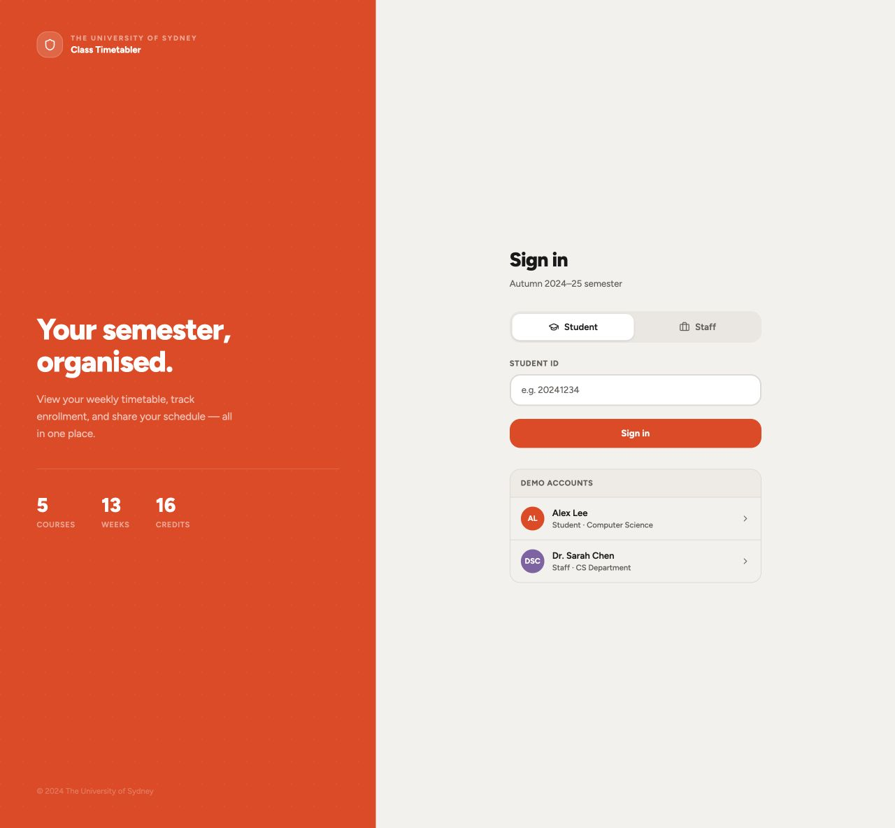
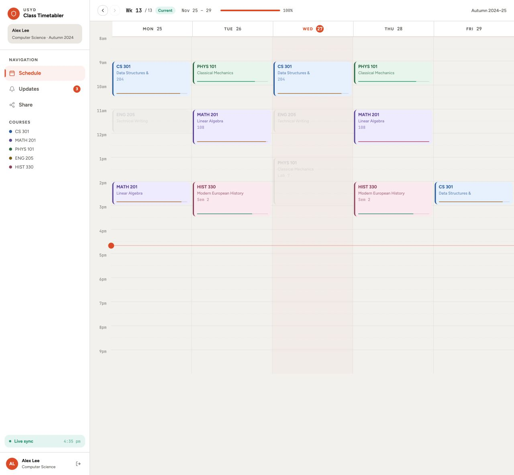
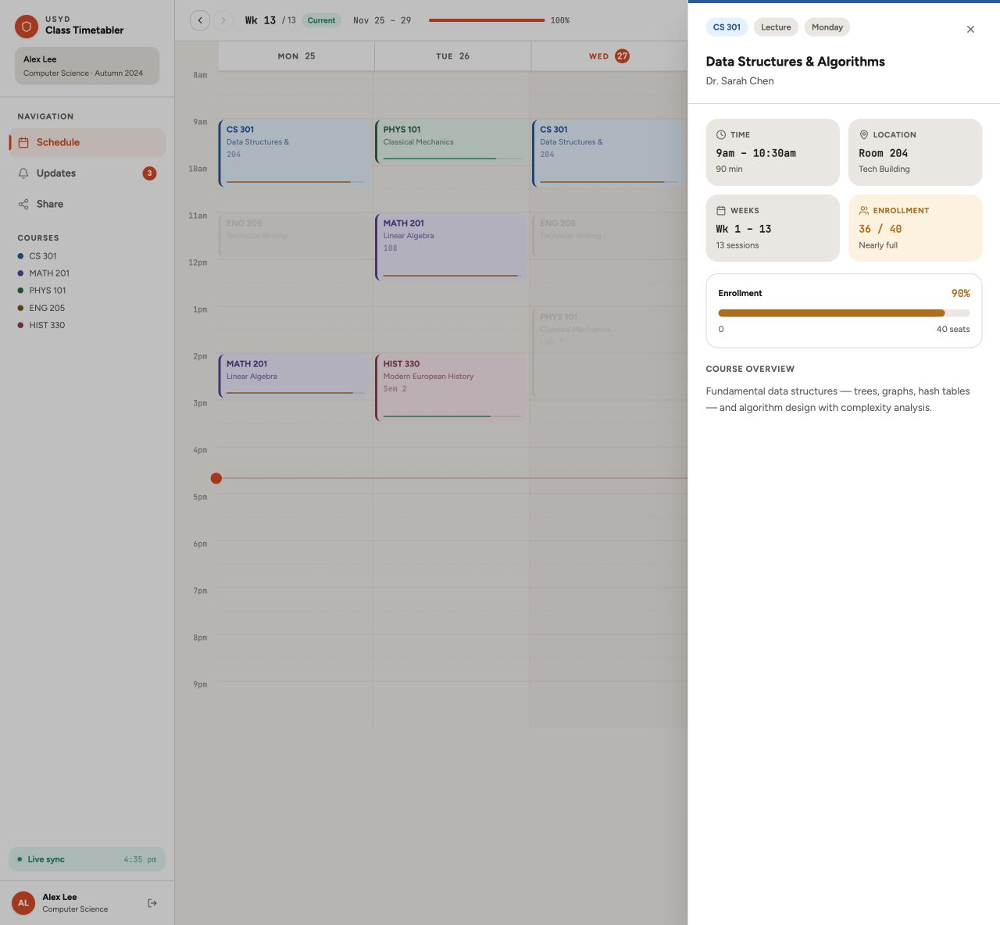
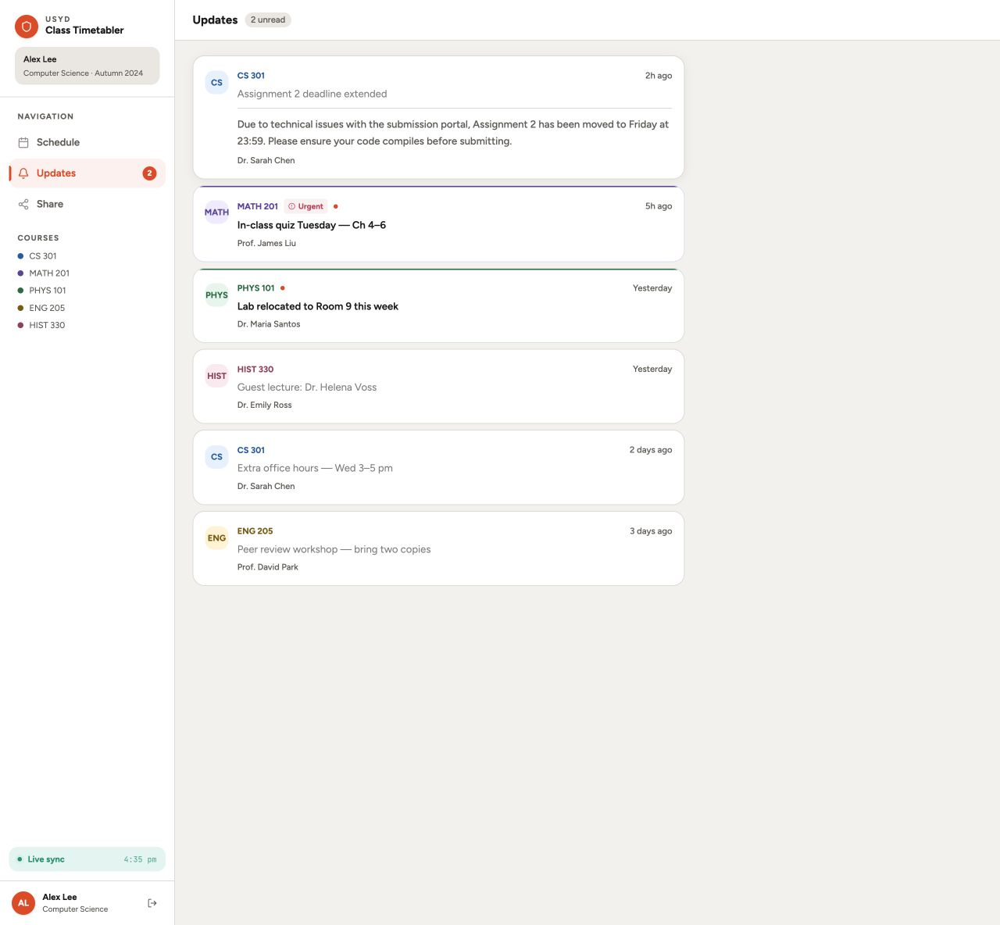
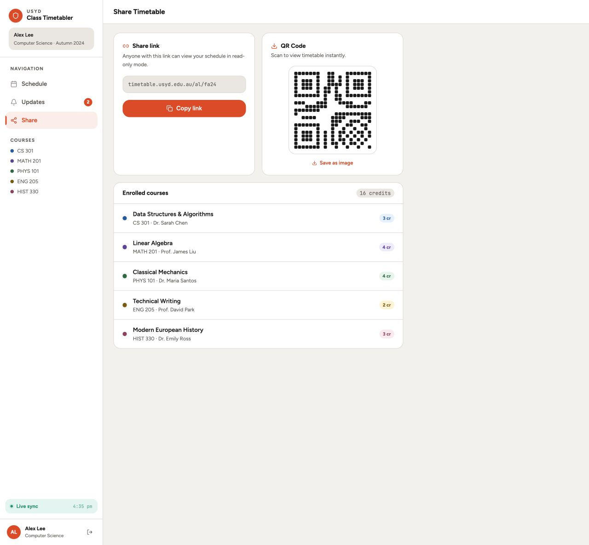
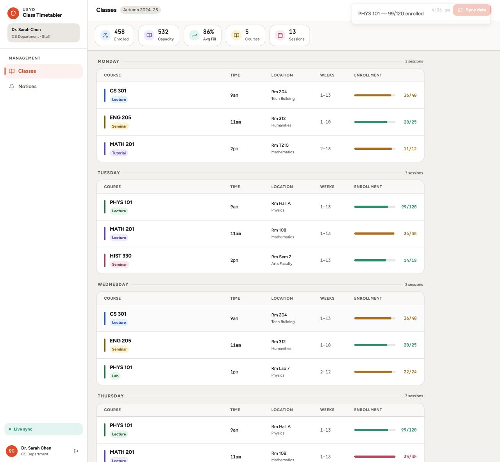
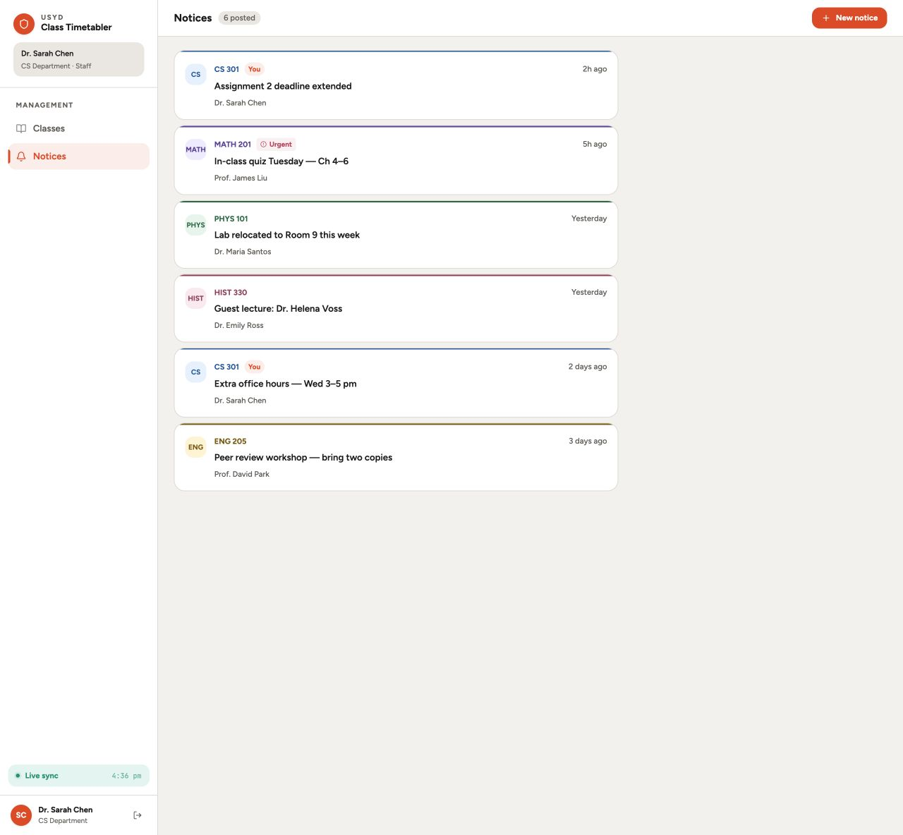
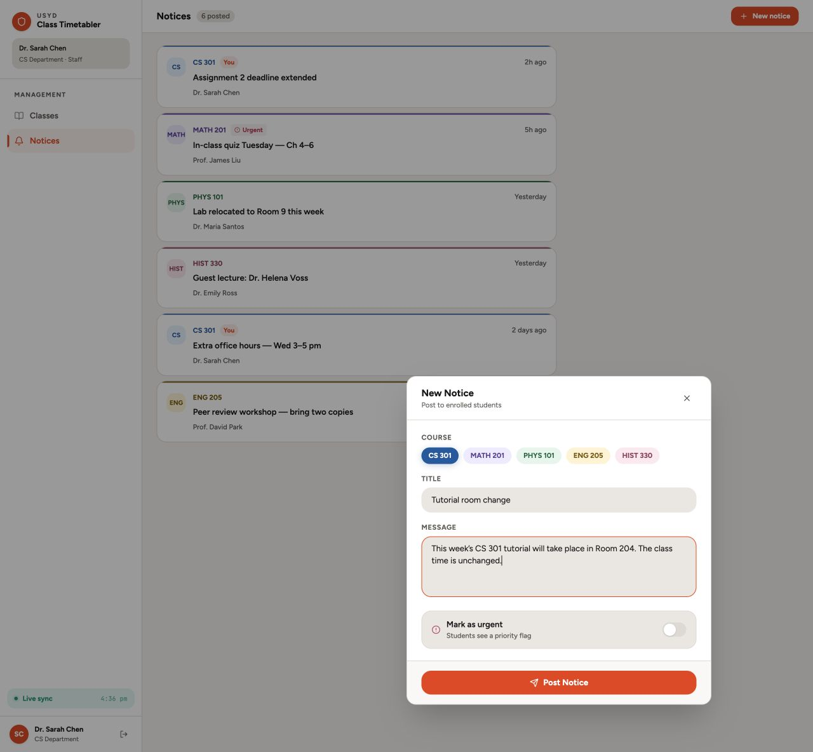

# 界面原型

根据 `Mobile University Timetable App.zip` 整理，按“登录 → 学生端 → 教职员工端”的使用顺序展示。截图保留原型的英文界面，使用示例账户和课程数据。

本原型用于确认页面布局与交互流程，不代表对应需求已经实现或通过验收。需求编号对应[用户故事与验收标准](../01_需求工程/02_用户故事、验收标准与可追溯性.md)，关联见[可追溯列表](../01_需求工程/03_可追溯列表.md)。

## 1. 登录

**对应需求：US-01。** 选择学生或教职员工身份，进入各自的界面；演示账户用于快速体验。

## 2. 学生端

### 2.1 个人课程表

**对应需求：US-02。** 按周展示课程安排，通过颜色区分科目，点击课程查看详情。

### 2.2 课程详情与容量

**对应需求：US-02、US-03。** 展示课程类型、教师、时间、地点、教学周及已报名人数与容量。

### 2.3 查看公告

**对应需求：US-06。** 按课程展示公告，显示发布者、时间和未读提示；点击展开正文。

### 2.4 分享课程表

**对应需求：US-04。** 展示分享链接、二维码和课程清单，表达只读分享的交互方向。

## 3. 教职员工端

### 3.1 课程概览

**对应需求：US-05、US-03。** 按星期查看课程记录及容量，并展示汇总信息和同步入口。

### 3.2 公告管理

**对应需求：US-06。** 查看公告列表，区分本人发布的公告，并提供新建入口。

### 3.3 新建公告

**对应需求：US-06。** 选择课程，填写标题和正文，可设置优先标记。图中内容为演示填写。

## 4. 原型边界与待补充内容

| 需求 | 当前原型与后续工作 |
| --- | --- |
| US-01 登录与权限 | 当前使用演示账户；正式身份认证及服务端权限校验待实现。 |
| US-02 课程表 | 已展示桌面流程；移动端布局、加载失败和无课程状态需补充确认。 |
| US-03 容量与数据可信度 | 已展示示例容量；数据来源、验证状态及无容量数据提示待补充。 |
| US-04 分享与比较 | 链接、二维码及按钮为演示；用户同意、分享范围、访问控制和比较视图待补充。 |
| US-05 信息维护 | 已展示课程概览；批准字段编辑、保存反馈及审计界面待补充。 |
| US-06 公告 | 新建公告仅更新本地状态；编辑、撤回、按用户群体定向及正式发布待补充。优先标记不用于紧急事件通信。 |
| US-07 更新同步 | `Live sync` 和容量变化为本地模拟，尚未验证学生端与教职员工端的真实同步。 |

原型使用 Vite + React。正式系统仍以[技术栈与技术选型结论](02_技术栈与技术选型结论.md)中的 Next.js 等选型为准；交互权限以[业务规则与权限矩阵](04_业务规则与权限矩阵.md)为依据。
