# 界面原型

本版以 [UniSchedule 新版 Figma 设计](https://www.figma.com/design/F9PdvZ2BAiF2pOJ6lmr6uY/Untitled) 为界面来源，更新日期为 **2026-09-19**。已导出 Page 1 中全部 **21 张顶层界面与状态图**，均为 **1440 × 900** 桌面画板；按登录、学生端、教职员工端整理。每张图片附有对应 Figma 节点链接，便于继续编辑与核对。

本版替代此前从 `Mobile University Timetable App.zip` 整理的 8 张截图；旧版可在 Git 历史中查看。截图保留英文界面及示例内容，表示视觉与交互设计，不代表业务已实现或通过验收。

需求编号对应[用户故事与验收标准](../01_需求工程/02_用户故事、验收标准与可追溯性.md)，关联见[可追溯列表](../01_需求工程/03_可追溯列表.md)。本次更新保留新 UI 原貌，与现有规则和接口的差异列在第 4 节，不据此自动变更业务权限或项目范围。

## 1. 登录

**对应需求：US-01。** 左侧校园插画，右侧大学邮箱及密码表单，包含记住设备、忘记密码和注册入口。本次文件未包含注册、密码重置、登录失败及会话失效的独立画板。

**登录** · [Figma 原图](https://www.figma.com/design/F9PdvZ2BAiF2pOJ6lmr6uY/Untitled?node-id=26-4)

## 2. 学生端

### 2.1 个人课程表

**对应需求：US-02。** 左侧导航包含 Timetable、Announcements、Shared Timetables、Compare Timetables 和 Settings。主区域按周展示工作日课程、时间及地点，颜色区分科目；默认状态关闭详情抽屉。

**个人课程表** · [Figma 原图](https://www.figma.com/design/F9PdvZ2BAiF2pOJ6lmr6uY/Untitled?node-id=2-4)

### 2.2 课程详情与容量

**对应需求：US-02、US-03。** 选择课程后打开右侧详情抽屉，展示类型、教师、时间、地点、在线链接、报名人数、容量、剩余名额、候补人数、来源、验证状态及更新时间。底部保留 Course Notes、Edit Class 和 Remove 设计，具体权限与数据归属见第 4 节。

**课程详情与容量** · [Figma 原图](https://www.figma.com/design/F9PdvZ2BAiF2pOJ6lmr6uY/Untitled?node-id=6-2)

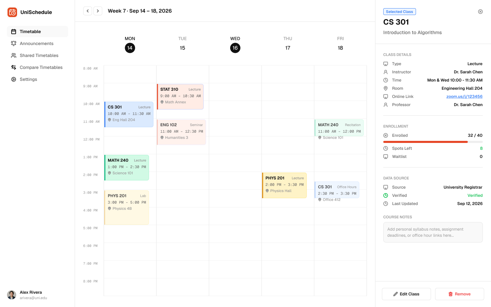

### 2.3 查看公告

**对应需求：US-06。** 列表展示课程、消息、发送者和日期，提供 All / Unread 筛选及新消息数量；详情状态在右侧展开公告正文和背景信息，并包含 Reply / Archive 入口。两个画板使用不同示例公告，不代表同一条数据的前后状态。

**公告列表** · [Figma 原图](https://www.figma.com/design/F9PdvZ2BAiF2pOJ6lmr6uY/Untitled?node-id=38-8)

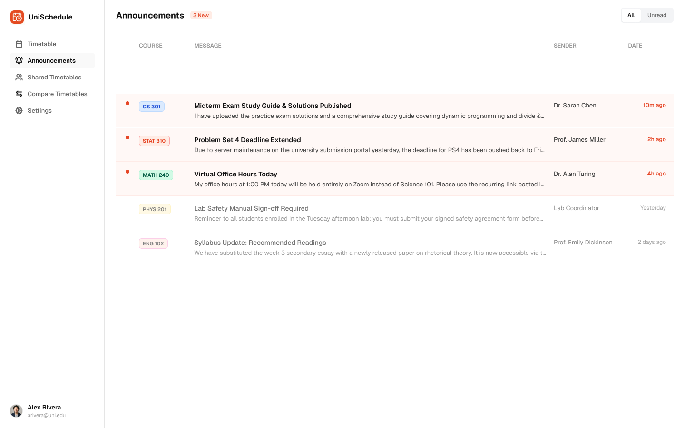

**公告详情** · [Figma 原图](https://www.figma.com/design/F9PdvZ2BAiF2pOJ6lmr6uY/Untitled?node-id=38-128)

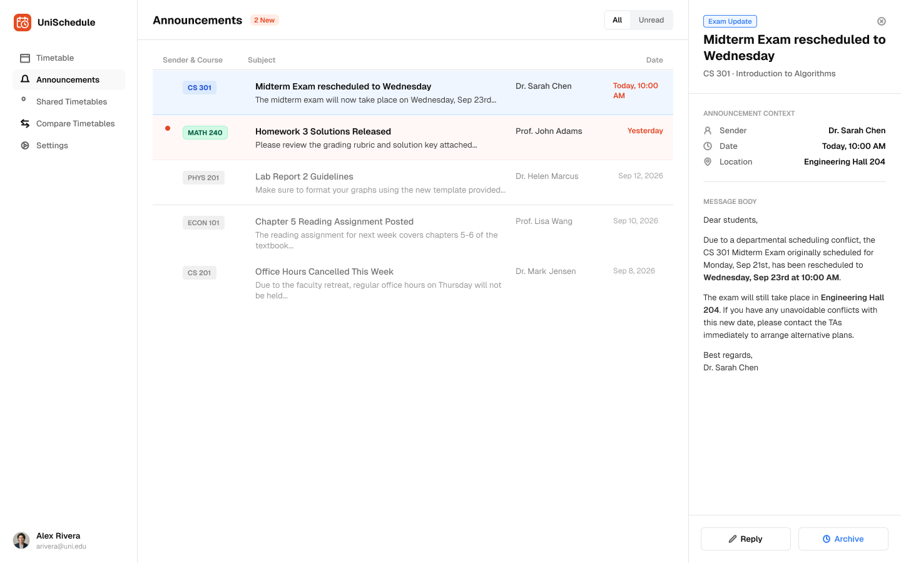

### 2.4 分享课程表

**对应需求：US-04；Calendar Feed 涉及 EXT-01。** 六张画板覆盖分享列表、创建表单、分享范围选择、创建成功及复制链接、撤销确认、撤销后状态。可选择 Full Timetable / Availability Only、Person / Calendar Feed，以及 None / 7d / 30d / Custom 有效期。列表区分 Active、Expired、Revoked，已撤销项显示 Delete 入口。

**分享列表** · [Figma 原图](https://www.figma.com/design/F9PdvZ2BAiF2pOJ6lmr6uY/Untitled?node-id=43-823)

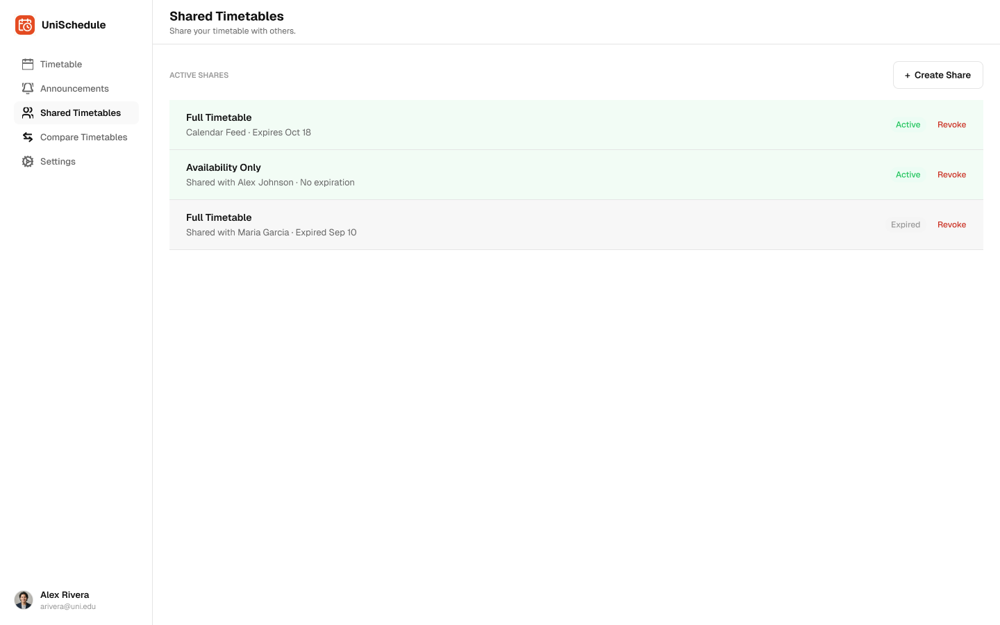

**创建分享** · [Figma 原图](https://www.figma.com/design/F9PdvZ2BAiF2pOJ6lmr6uY/Untitled?node-id=43-887)

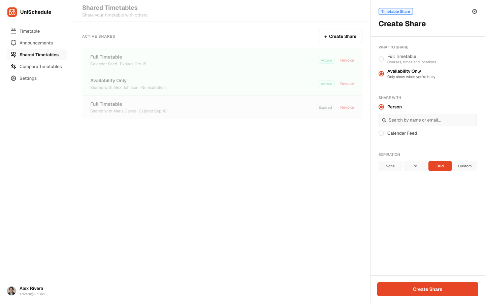

**分享范围** · [Figma 原图](https://www.figma.com/design/F9PdvZ2BAiF2pOJ6lmr6uY/Untitled?node-id=43-1123)

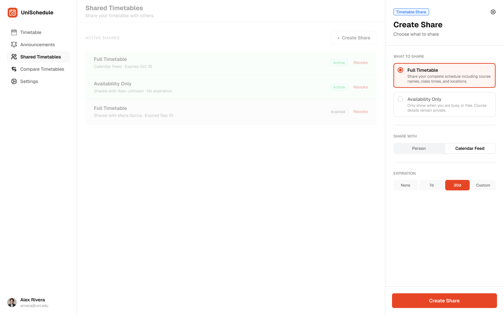

**分享创建成功** · [Figma 原图](https://www.figma.com/design/F9PdvZ2BAiF2pOJ6lmr6uY/Untitled?node-id=43-1239)

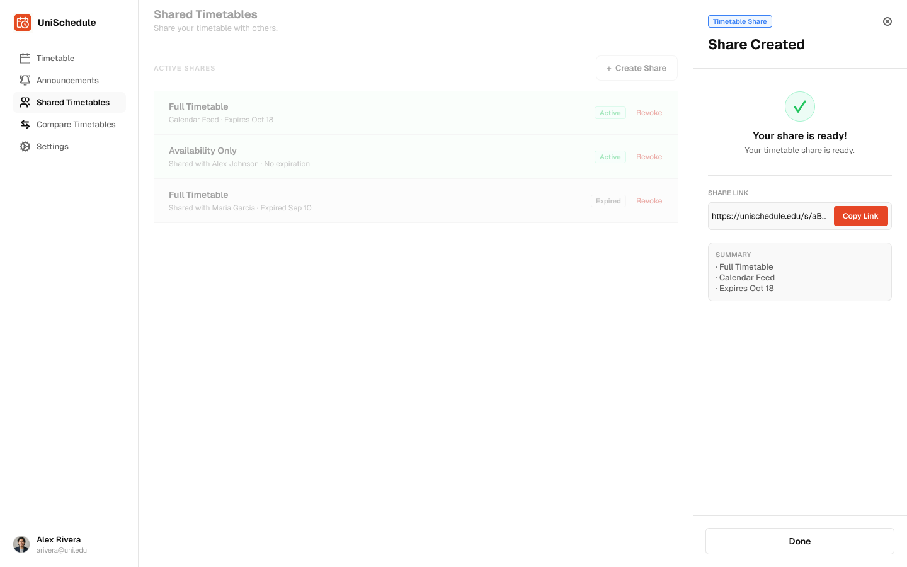

**撤销分享确认** · [Figma 原图](https://www.figma.com/design/F9PdvZ2BAiF2pOJ6lmr6uY/Untitled?node-id=43-1336)

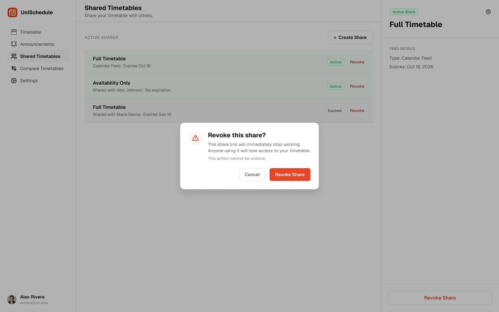

**分享已撤销** · [Figma 原图](https://www.figma.com/design/F9PdvZ2BAiF2pOJ6lmr6uY/Untitled?node-id=43-1435)

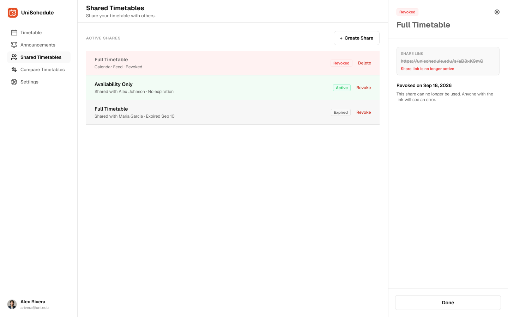

### 2.5 比较课程表

**对应需求：US-04。** 粘贴分享链接后比较本人和对方的安排。三张画板分别表示未输入时的空状态、有效分享的比较视图、链接无效或不再可用的错误状态。Availability only 示例用 Busy 隐去对方课程详情；画面呈现并排比较，不作为已实现冲突检测的证据。

**比较空状态** · [Figma 原图](https://www.figma.com/design/F9PdvZ2BAiF2pOJ6lmr6uY/Untitled?node-id=53-6)

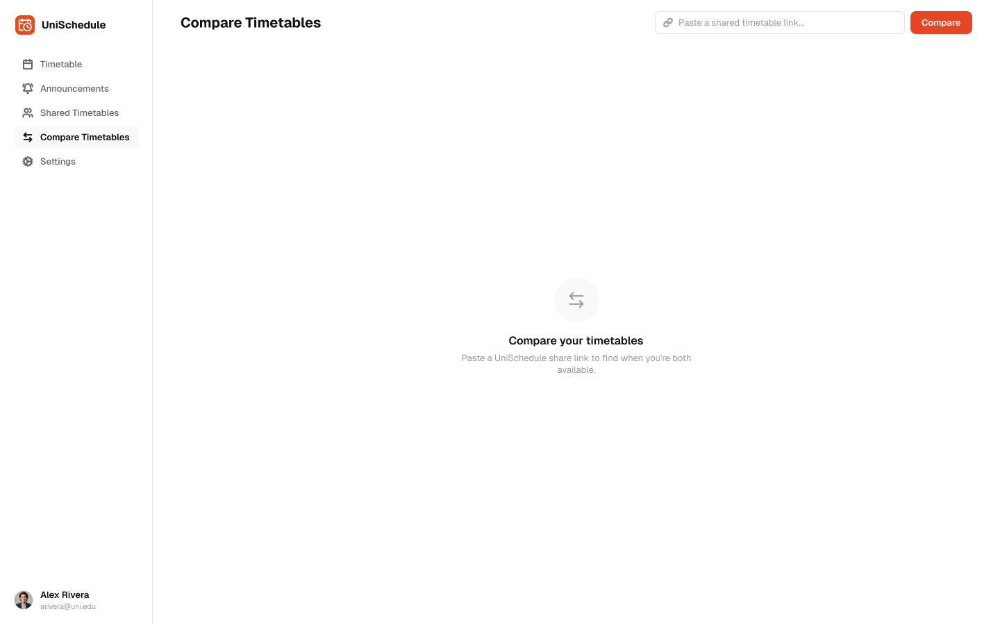

**比较课程表** · [Figma 原图](https://www.figma.com/design/F9PdvZ2BAiF2pOJ6lmr6uY/Untitled?node-id=53-50)

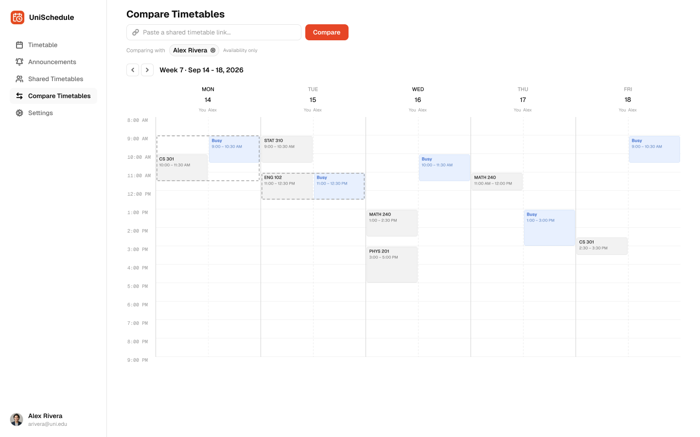

**比较链接失效** · [Figma 原图](https://www.figma.com/design/F9PdvZ2BAiF2pOJ6lmr6uY/Untitled?node-id=53-278)

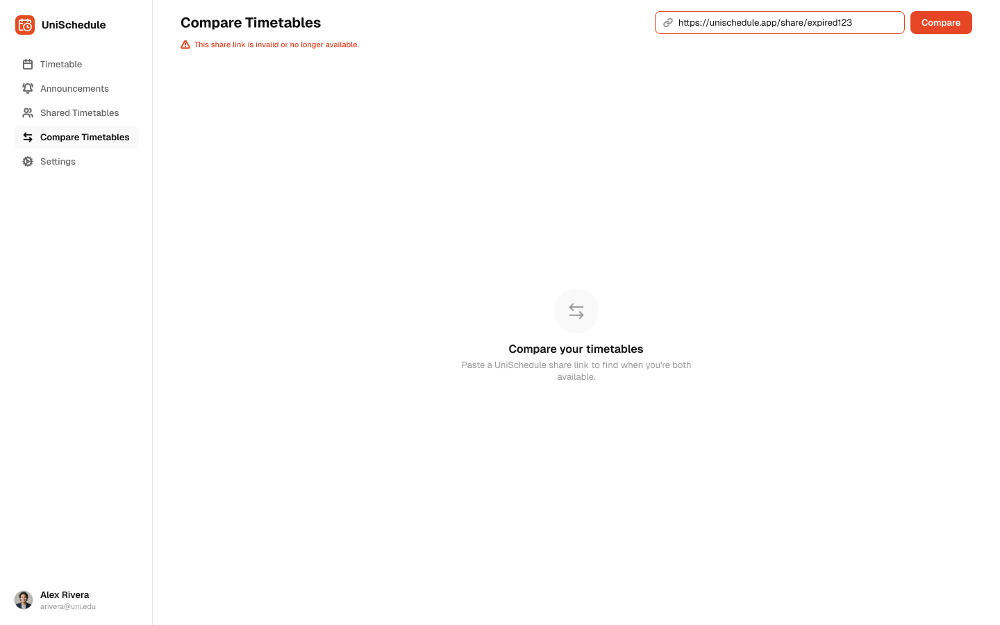

## 3. 教职员工端

### 3.1 课程概览

**对应需求：US-05、US-03。** Staff Workspace 按学期、科目和班级组织课程，展示 Coordinator / Teaching Staff 身份及班级容量、剩余名额、Limited / Full 状态。导航包含 Workspace、Management 和 Audit Log。

**教职员工工作台** · [Figma 原图](https://www.figma.com/design/F9PdvZ2BAiF2pOJ6lmr6uY/Untitled?node-id=76-550)

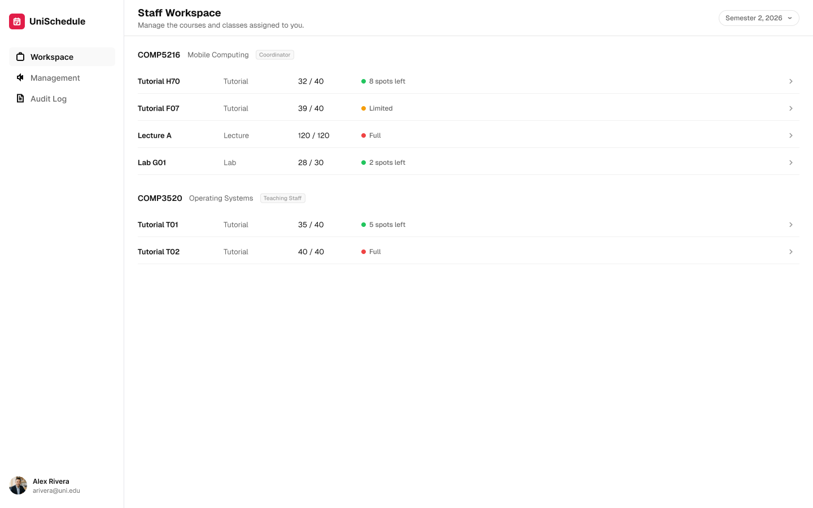

### 3.2 公告管理

**对应需求：US-06。** 列表提供 All / Draft / Published 筛选，展示标题、范围、状态、日期及编辑、发布、撤回入口，并提供 Create Announcement 按钮。编辑抽屉包含标题、锁定的 CLASS 范围、正文、草稿状态和 Save Draft / Publish 按钮。本次没有独立的新建公告或撤回确认画板。

**公告管理** · [Figma 原图](https://www.figma.com/design/F9PdvZ2BAiF2pOJ6lmr6uY/Untitled?node-id=90-5)

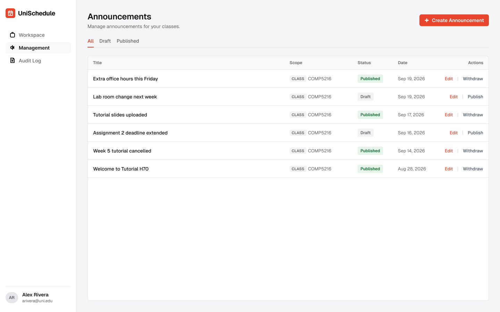

**编辑公告** · [Figma 原图](https://www.figma.com/design/F9PdvZ2BAiF2pOJ6lmr6uY/Untitled?node-id=90-148)

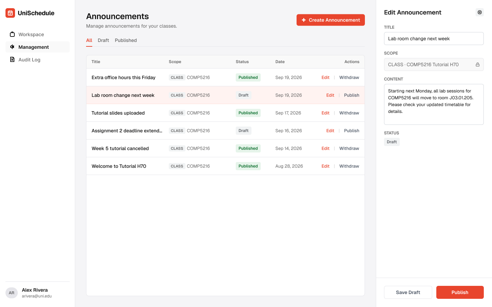

### 3.3 班级管理与课程安排编辑

**对应需求：US-05、US-03；可写字段待与现有规则对齐。** 班级页面展示时间、地点、授课方式、验证状态、有效容量、剩余名额、容量覆盖以及额外课程安排。容量覆盖示例包含超出教室座位数的警告。编辑抽屉展示星期、起止时间、地点、授课方式、在线地址、安排状态与验证状态，以及取消和保存操作。

**班级管理** · [Figma 原图](https://www.figma.com/design/F9PdvZ2BAiF2pOJ6lmr6uY/Untitled?node-id=76-671)

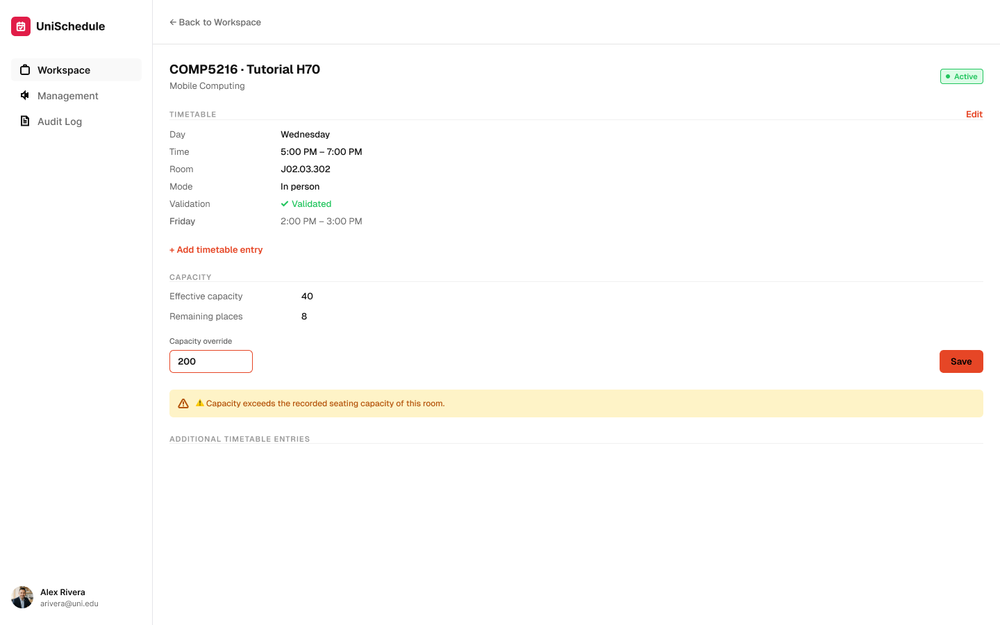

**编辑课程安排** · [Figma 原图](https://www.figma.com/design/F9PdvZ2BAiF2pOJ6lmr6uY/Untitled?node-id=76-781)

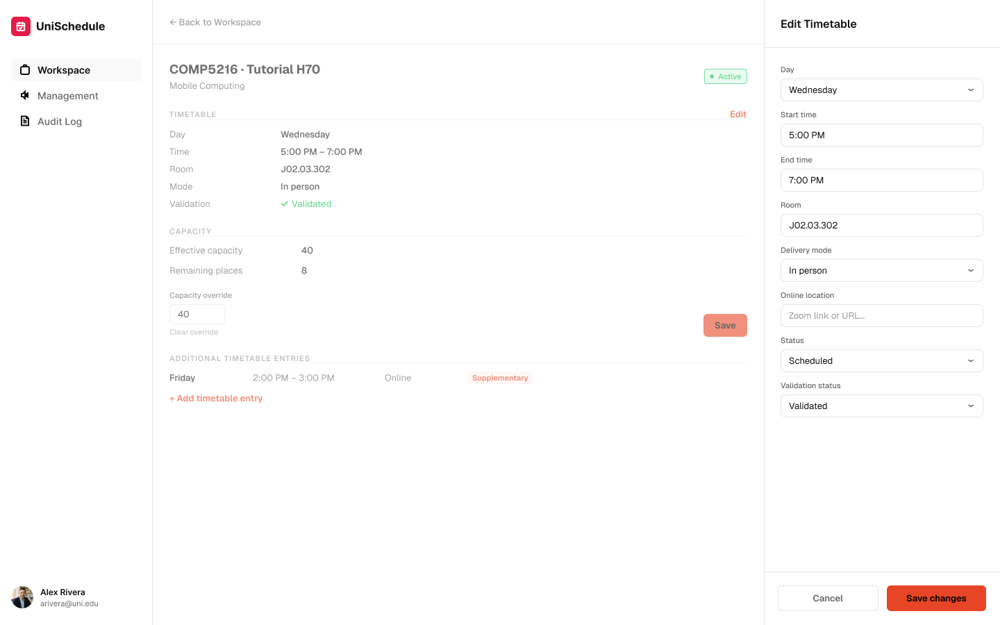

### 3.4 审计日志

**对应需求：US-05、US-06；审计查询权限待确认。** 列表支持操作者、操作、资源及日期范围筛选，展示时间、操作者、角色、操作、资源和摘要。右侧抽屉展示单条记录的操作详情、变更摘要、审计 ID 与实体 ID。列表中的授权变更及系统同步记录属于示例内容，不表示新增角色管理功能已经获批。

**审计日志列表** · [Figma 原图](https://www.figma.com/design/F9PdvZ2BAiF2pOJ6lmr6uY/Untitled?node-id=84-5)

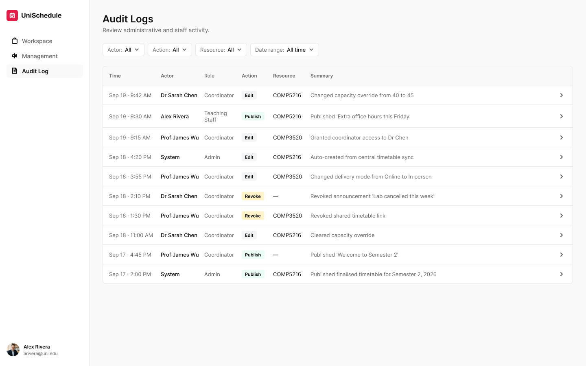

**审计日志详情** · [Figma 原图](https://www.figma.com/design/F9PdvZ2BAiF2pOJ6lmr6uY/Untitled?node-id=84-191)

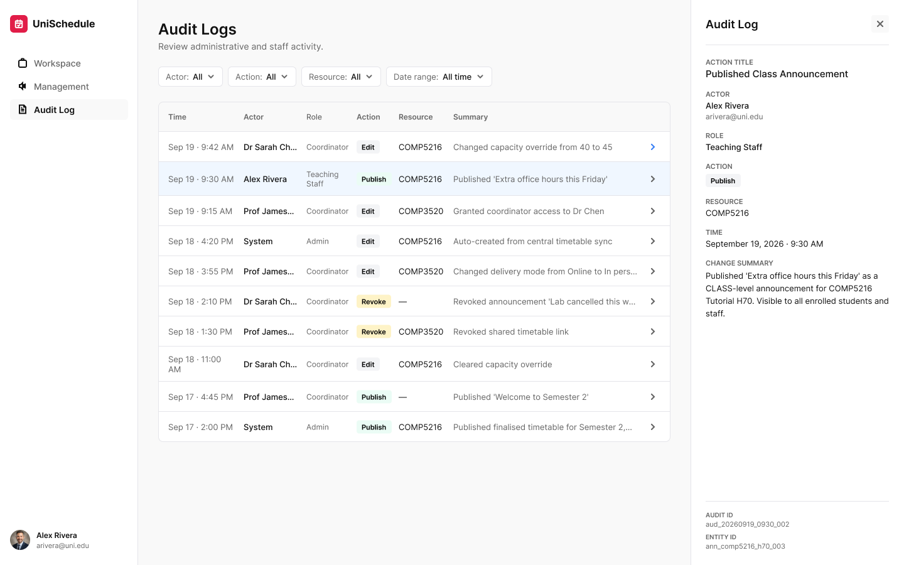

## 4. 原型边界与待补充内容

### 4.1 与当前业务规则和接口的差异

以下按新版 UI 实际内容记录，供后续需求评审与实现对齐；现有[业务规则与权限矩阵](04_业务规则与权限矩阵.md)及[接口契约](06_接口契约.md)仍保留其草案状态。

| 设计内容 | 当前契约 / 范围 | 后续需明确 |
| --- | --- | --- |
| 学生详情的 Edit Class、Remove、Course Notes | 当前学生无修改官方安排、选课或分班的权限，也无个人笔记接口 | 明确是否仅操作个人显示或笔记，不能解释为修改正式记录 |
| 教师编辑时间、地点、授课方式、验证状态、容量覆盖及新增安排 | 当前仅允许维护补充 content，未提供上述写入接口 | 确认官方与补充数据边界、字段白名单、验证权限、容量规则，再更新模型与契约 |
| Person / Calendar Feed 分享、复制链接、无限期分享、按姓名或邮箱搜索 | 当前暂按指定接收人登录访问，要求 expiresAt；不开放任意用户搜索；日历订阅属于 EXT-01 | 明确接收人选择、链接与认证关系、期限、同意记录及订阅撤销规则；UI 链接不代表公开访问已获批准 |
| Full Timetable / Availability Only 与分享删除 | 当前使用 allowedFields，已有撤销但没有删除接口 | 定义两种分享选项到字段白名单的映射，以及删除与撤销、审计保留的区别 |
| 公告 CLASS 级范围及已发布公告的 Edit 按钮 | 当前 targets 仅 course / group，且只允许编辑 draft | 确认班级是否新增目标类型，以及已发布公告的编辑规则，避免向整门科目误发班级公告 |
| 公告未读、回复及归档 | 当前仅规定可见公告查询，无已读、回复或归档接口 | 明确属于当前版本还是后续扩展，并补充相应数据与权限设计 |
| Audit Log 导航与查询筛选 | 当前有审计写入模型，但没有列表/详情接口，教职员工不默认拥有查看权 | 定义可查询角色、记录范围及敏感字段，不因界面存在而自动授予权限 |

### 4.2 设计覆盖与实现状态

| 需求 | 本次设计覆盖 | 仍需落实 |
| --- | --- | --- |
| US-01 | 登录表单 | 认证、角色分流、越权及会话异常处理 |
| US-02 | 周课表和详情抽屉 | 移动布局、加载、空课表和查询失败状态 |
| US-03 | 容量、剩余名额、候补、来源及验证时间 | 未知容量、过期/失败、测试来源提示以及各数值的业务定义 |
| US-04 | 创建、范围、成功、撤销、失效及比较状态 | 明确同意提示、接收人授权、分享字段校验及失效后的客户端清理 |
| US-05 | 工作台、班级编辑、容量警告及审计列表/详情 | 可写字段确认、保存失败、并发冲突、权限拒绝及实际审计 |
| US-06 | 学生列表/详情、教师管理/编辑、发布/撤回入口 | 新建、撤回后状态、目标权限及发布/撤回结果反馈 |
| US-07 | 多角色页面及数据状态展示 | 真实同步、断线恢复和同步失败提示，本次静态截图不验证同步能力 |
| NFR-02 | 21 张 1440 × 900 桌面画板 | 本次无独立移动端画板；Settings 只有导航入口 |

正式应用技术选型仍以[技术栈与技术选型结论](02_技术栈与技术选型结论.md)为准。本次交付是 Figma 原图导出与文档同步，不包含应用实现。
