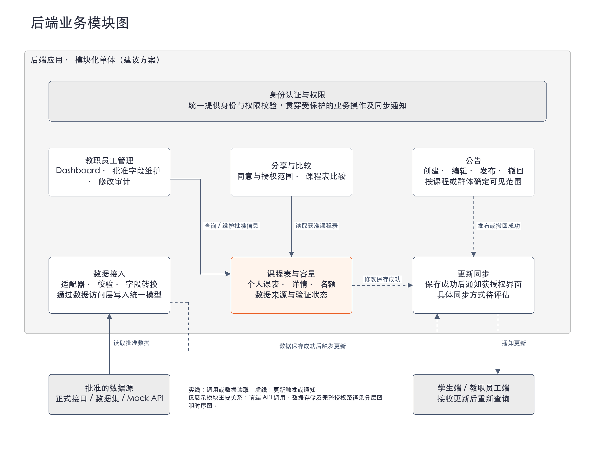
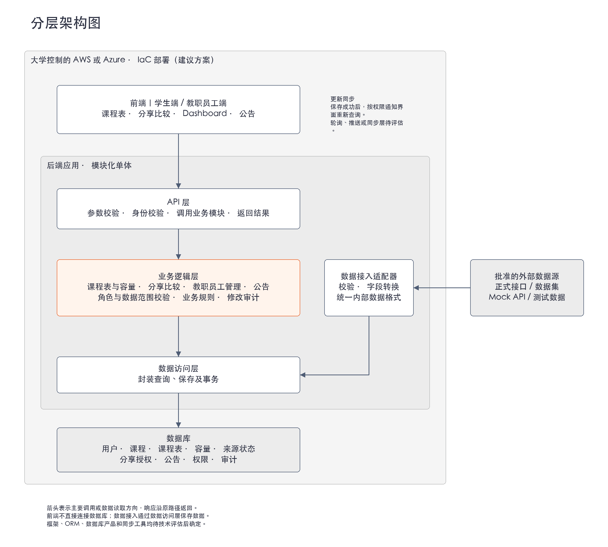
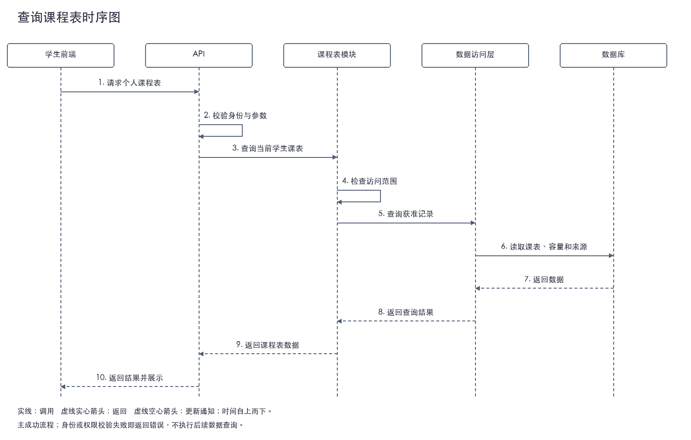
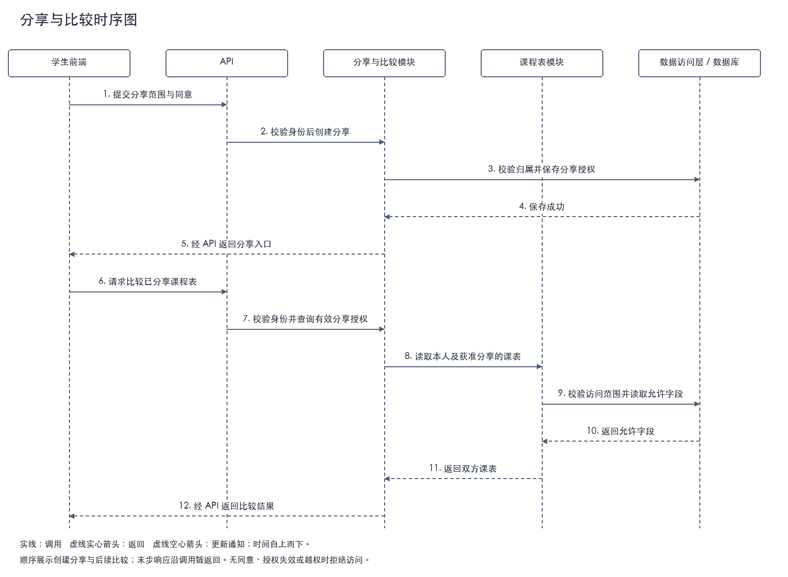
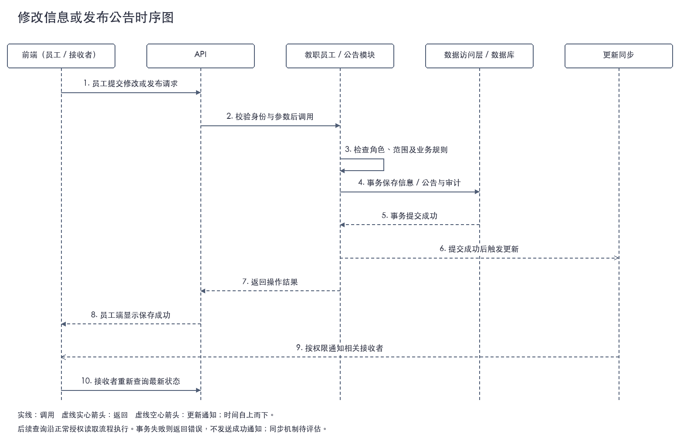
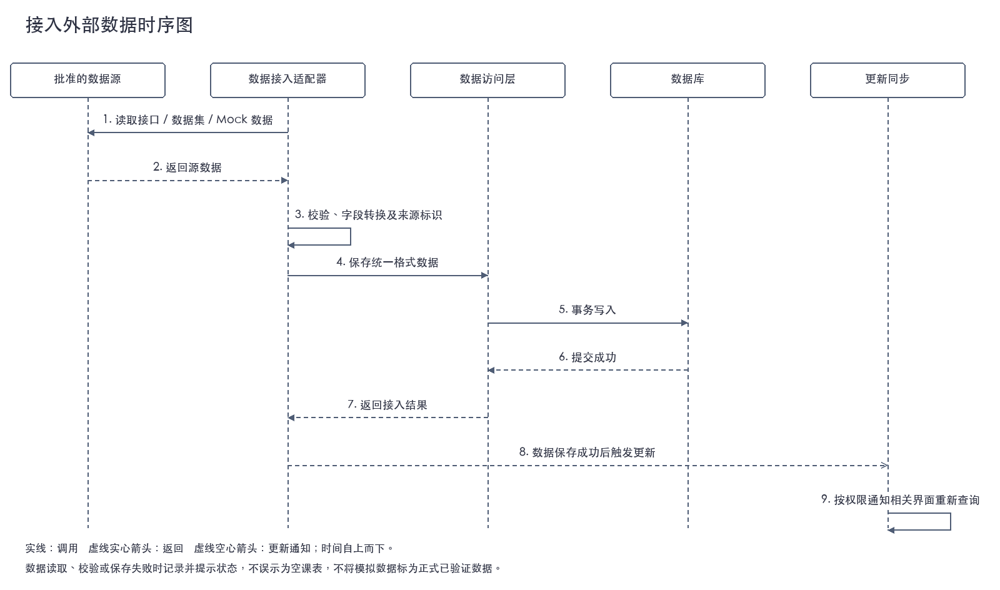

# 系统架构

## 1. 后端有哪些业务模块

采用**分层的模块化单体架构**作为试点建议方案：业务模块在同一个后端应用中运行，按职责划分，便于在 13 周内开发、部署和移交。具体框架、数据库及同步工具通过技术评估后确定。

下图展示后端业务模块及其协作关系；框外的数据源和用户端表示外部交互对象。前端、API 与数据库的整体分层见第 2 节。

| 模块 | 主要职责 |
| --- | --- |
| 身份认证与权限 | 识别用户身份，控制学生和教职员工的数据访问及操作权限 |
| 课程表与容量 | 查询个人课程表、课程详情、容量或可用名额，展示来源和验证状态 |
| 分享与比较 | 管理学生同意的分享范围，提供获授权课程表的比较数据 |
| 教职员工管理 | 提供 Dashboard 数据，维护批准的信息，记录修改审计 |
| 公告 | 创建、编辑、发布、撤回公告，按课程或用户群体控制可见范围 |
| 数据接入 | 将批准的数据源转换为内部统一格式，隔离正式接口与测试数据的差异 |
| 更新同步 | 将已保存的信息变化通知有权访问的用户，使相关界面重新获取最新数据 |

## 2. 前端、API、业务逻辑与数据库怎么分

| 层次 | 负责什么 | 边界 |
| --- | --- | --- |
| 前端 | 学生课程表、分享比较界面、教职员工 Dashboard、公告管理及状态提示 | 通过 API 获取和提交数据；不直接连接数据库；界面隐藏不能代替权限校验 |
| API 层 | 接收请求、校验参数和登录身份、调用业务模块、返回统一结果 | 不承载主要业务规则，不直接向客户端暴露数据库结构 |
| 业务逻辑层 | 判断数据访问范围、可修改字段、分享授权、公告状态和目标群体 | 对每次业务操作执行授权与规则检查，通过数据访问层读写数据库 |
| 数据访问层 | 封装查询、保存及事务操作 | 集中管理数据库访问，避免各模块重复编写存储逻辑 |
| 数据库 | 保存用户关联、课程、课程表条目、容量、来源状态、分享授权、公告、权限及审计记录 | 通过约束和事务保持一致性；只保存试点所需数据，不替代官方学术记录系统 |

数据接入模块位于后端，通过适配器读取正式接口、数据集或 Mock API，再写入统一的数据模型。前端及业务模块不依赖某个外部数据源的专有格式。

## 3. 模块之间怎么调用

### 查询课程表

学生前端 → API 身份校验 → 课程表模块检查访问权限 → 数据访问层 → 数据库 → 返回课程表、容量和来源状态。

### 分享与比较

学生前端 → API → 分享与比较模块检查分享授权 → 课程表模块读取获准字段 → 返回比较结果。

分享模块不能绕过课程表模块的访问规则；未获授权的私人课程表不返回给请求者。

### 教职员工修改信息或发布公告

教职员工前端 → API → 对应业务模块检查角色、操作范围及数据 → 在事务中保存修改与审计 → 提交成功后触发更新同步 → 获授权界面重新查询。

同步通知同样执行权限控制。具体采用轮询、推送或同步层，根据时效要求和运维成本评估，不预先绑定某项技术。

### 接入外部数据

批准的数据源 → 数据接入适配器 → 校验与字段转换 → 数据访问层 → 数据库 → 更新同步。

数据源不可用时应明确提示更新状态，不能将失败当作空课程表，也不能将模拟或补充数据标为已验证的正式数据。

## 4. 部署边界

前端、后端应用和数据库部署在大学控制的 AWS 或 Azure 环境，使用 IaC 管理基础设施。密钥通过部署环境管理，不写入前端或源代码。

本方案不要求微服务拆分，也不强制依赖付费 SaaS。外部数据接口、认证方式、可维护字段和更新时限需与客户确认后落实。
